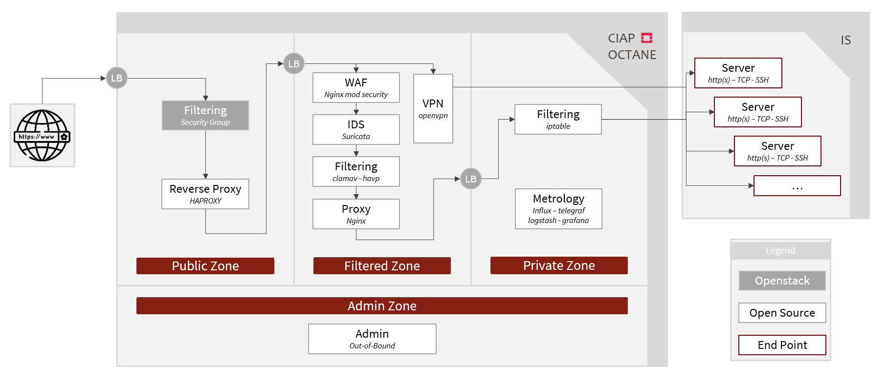
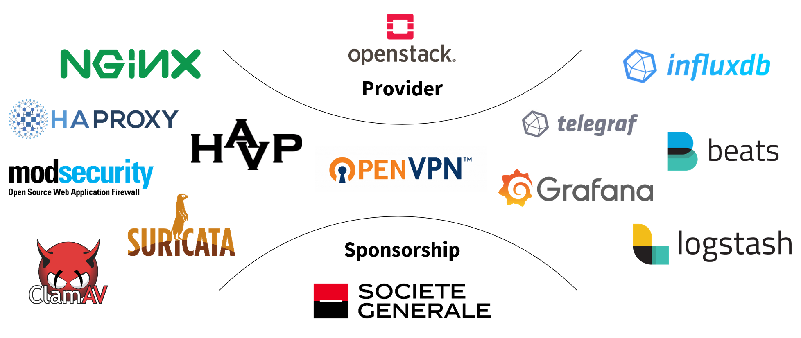

# Openstack cIAP OCTANE

## What's OCTANE ?

**OCTANE** is:

* A cIAP (**C**loud **I**nternet **A**ccess **P**oint). Mainly, it is a **security product** between Internet and your public application hosted in your private zone
* The acronym (with imagination and goodwill) of **Opensource cIAP Nextgen**
* A [Societe Generale](https://www.societegenerale.com) Open Source project developped within **Public Cloud**
* Feature Team (Cloud Center Of Excellence) by:
    * [Aubin LAGORCE](https://github.com/AubSs) for Openstack
    * [Eric BOUTEVILLE](https://github.com/qrn77) for [AWS](https://github.com/societe-generale/OCTANE)
* Is currently available for [AWS](https://github.com/societe-generale/OCTANE) & Openstack

**OCTANE** can:

* **Securly expose** a WebSite to Internet
* Protect you against **intrusions** (SQL injection, cross-site scripting (XSS), file inclusion...) & **virus**
* Limit you against **deny of service**
* Detect **malicious activities** or **policy violations**
* Securly **connect your external users** to your internal zone
* Collect **all the logs** and provide **metrics, search and analytics**
* Be **easly derivated on other x86** (GCP, Bare-Metal, etc.) platform in order to have **the same Internet Access Point in a multi-cloud context**

## How OCTANE is designed ?

There are several layers (from the most exposed -Internet- to the less exposed -Internal-) :

* Redundant load-balancers
* Redundant filtering layer
* Redundant reverse-proxies
* Redundant proxies with SSL terminaison
* Redundant WAF or TCP relay (it depends on the protocol used)
* Redundant Antivirus & IDS
* Redundant VPN
* Redundant firewalls

Those functionnalities are deployed by:
* The **Openstack orchestration heat template** aims to build the Openstack infrastructure
* The **Ansible playbook** will configure all software components

For further details, a more complete READme is available in each directory.

## Detailed documentation

* [Build & Run](docs/README.md "Build & Run")
* [Architecture](docs/architecture.md "Architecture")
* [Bring up a complete OpenStack environment](openstack/README.md "Bring up a complete OpenStack environment")
* [Ansible](ansible/README.md "Ansible")
    * [Ansible variables](ansible/vars/README.md "Ansible variables")
    * [Ansible roles](ansible/roles/README.md "Ansible roles")
    * [Ansible global variables](ansible/group_vars/README.md "Ansible global variables")

## Roadmap

* Common referential (LDAP/other), this will permit to link users to domains/VPN.
* API to manage web exposition

## License

[GPLv2](https://www.gnu.org/licenses/old-licenses/gpl-2.0.en.html)

## Authors

This project has been created in 2019 by [Aubin LAGORCE](https://github.com/AubSs) and Product Owned by [Yannick NEFF](https://github.com/yannickneff) based on the work of [Eric BOUTEVILLE](https://github.com/qrn77), for its [AWS](https://github.com/societe-generale/OCTANE) implementation.

## Contributors

* [Lucas BARRIERE](https://github.com/urluba)
* [Eric BOUTEVILLE](https://github.com/qrn77)
* [Yannick NEFF](https://github.com/yannickneff)
* [Pierre LEVESQUE](https://github.com/PierreLev74)

## Sponsorship, Softwares & Used Components

