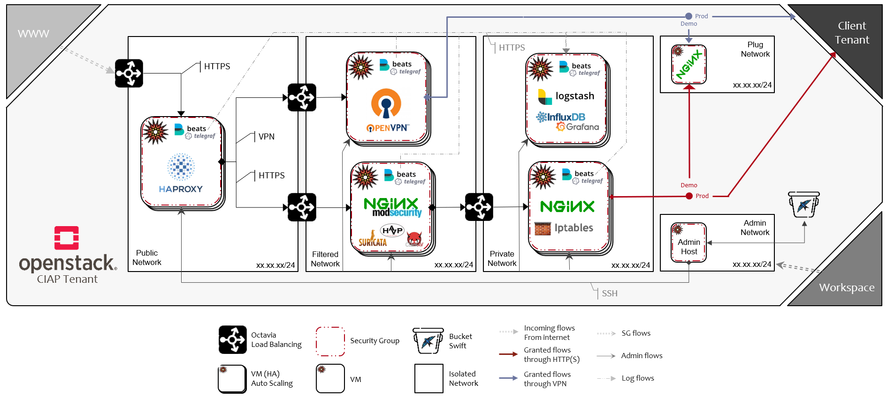
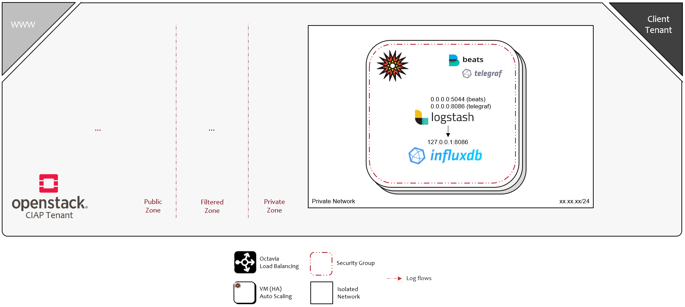

# Architecture

> Return to [Homepage](../README.md "Homepage")

## Presentation

This section presents the detailed architecture.

### Architecture

---

### High-level design

---

### Low level design: Public zone

---

### Low level design: Filtered zone | HTTPS

---

### Low level design: Filtered zone | VPN

---

### Low level design: Private zone | Filtering

---

### Low level design: Private zone | Metrology

